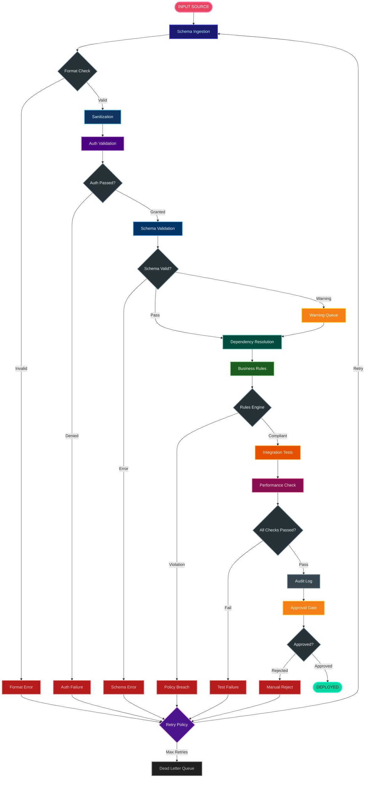
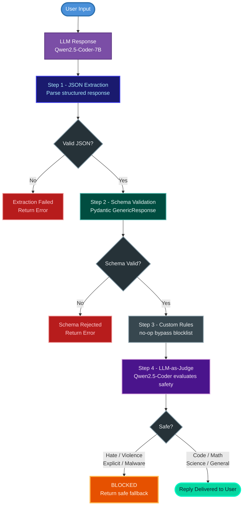

# ChatGuard 🛡️

[](https://www.python.org/downloads/)
[](https://docs.astral.sh/uv/)
[](https://huggingface.co/Qwen/Qwen2.5-Coder-7B-Instruct)
[](https://pypi.org/project/trustguard/)
[](https://fastapi.tiangolo.com/)
[](https://gradio.app/)

A production-ready safe LLM chatbot powered by **Qwen2.5-Coder-7B-Instruct** via the HuggingFace Inference API, with real-time output validation using **TrustGuard** and an intelligent **LLM-as-Judge** safety pipeline.

---

## 📋 Overview

ChatGuard demonstrates how to build a safe, production-grade conversational AI system. Every response the model generates is automatically validated through a 4-step pipeline before reaching the user:

```
User Input → LLM (Qwen2.5-Coder) → JSON Extraction → Schema Validation → Rules → LLM Judge → Reply or 🛑 Blocked
```

The project is designed as a learning resource and portfolio showcase covering clean architecture, safety engineering, REST APIs, and web UI development.

---

## ✨ Features

| Feature | Description |
|---------|-------------|
| 🤖 LLM-as-Judge | Uses the same model to evaluate its own responses for safety |
| 🛡️ TrustGuard | 4-step validation pipeline: JSON → Schema → Rules → Judge |
| 💬 Conversation Memory | Full multi-turn chat history per session |
| 🔄 Follow-up Shortcuts | Type `more`, `yes`, `continue` to expand the last reply |
| 🌐 Gradio Web UI | Professional dark/light theme chat interface with streaming |
| ⚡ FastAPI REST API | Multi-session REST API with Swagger docs |
| 📊 Live Stats | Real-time TrustGuard validation metrics |
| 🔌 Modular Architecture | Clean separation of concerns — UI-agnostic core logic |

---

## 🏗️ Architecture



## 🛡️ ChatGuard's actual pipeline:


### Project Structure

```
ChatGuard/
├── main.py          # Terminal chat entry point
├── ui.py            # Gradio Web UI
├── api.py           # FastAPI REST API
│
├── chatbotV2.py     # Core chat logic (UI-agnostic)
├── config.py        # Centralized configuration
├── guard.py         # TrustGuard setup
├── judge.py         # LLM-as-Judge implementation
├── llm.py           # HuggingFace API client
├── memory.py        # Conversation memory
│
├── .env             # API token (never commit)
├── .env.example     # Token template
├── pyproject.toml   # Project dependencies
└── README.md
```

---

## 📦 Installation

### Prerequisites
- Python 3.13+
- [uv](https://docs.astral.sh/uv/) package manager
- HuggingFace account with API token

### Setup

```bash
# 1. Clone the repository
git clone https://github.com/your-username/chatguard.git
cd chatguard

# 2. Install dependencies
uv sync

# 3. Configure environment
cp .env.example .env
# Edit .env and add your HuggingFace token
```

### Environment Variables

Create a `.env` file based on `.env.example`:

```env
HF_TOKEN=hf_your_token_here
MODEL_ID=Qwen/Qwen2.5-Coder-7B-Instruct
MAX_TOKENS=500
JUDGE_MAX_TOKENS=80
```

Get your free HuggingFace token at → https://huggingface.co/settings/tokens

---

## 🚀 How to Run

### 1. Terminal (CLI)

The simplest way to chat directly in your terminal:

```bash
uv run python main.py
```

```
🤖 ChatGuard | type 'quit' to exit

You: explain what is an LSTM
Bot: An LSTM (Long Short-Term Memory) is a type of recurrent neural network...

You: more
Bot: To expand further, LSTMs use three gates to control information flow...
```

### 2. Gradio Web UI

A professional web interface with streaming, judge verdicts, and live stats:

```bash
uv add gradio
uv run python ui.py
```

Then open → http://localhost:7860

**UI Features:**
- 💬 Chat bubbles with streaming word-by-word responses
- 🛡️ Live judge verdict panel — shows `✅ APPROVED` or `🛑 BLOCKED` with reason
- 📊 Real-time session stats (total / approved / blocked / judge calls)
- ⚡ Validation pipeline panel
- 🌙 Dark / Light theme toggle
- 💬 Follow-up shortcuts reference

### 3. FastAPI REST API

A multi-session REST API with interactive Swagger docs:

```bash
uv add fastapi uvicorn
uv run uvicorn api:app --reload
```

Then open → http://localhost:8000/docs

**Available Endpoints:**

| Method | Endpoint | Description |
|--------|----------|-------------|
| GET | `/` | Health check |
| GET | `/stats` | TrustGuard validation stats |
| POST | `/chat` | Send a message |
| GET | `/sessions` | List all active sessions |
| GET | `/session/{id}` | Session info |
| GET | `/session/{id}/history` | Full conversation history |
| DELETE | `/session/{id}` | Delete a session |

**Example Request:**

```bash
curl -X POST http://localhost:8000/chat \
  -H "Content-Type: application/json" \
  -d '{"message": "explain what is an LSTM", "session_id": "user-1"}'
```

**Example Response:**

```json
{
  "reply": "An LSTM (Long Short-Term Memory) is a type of recurrent neural network...",
  "session_id": "user-1",
  "is_safe": true
}
```

---

## 🛡️ Safety Pipeline

ChatGuard uses a 4-step validation pipeline powered by TrustGuard:

### Step 1 — JSON Extraction
The LLM is instructed to respond in a structured JSON format. The pipeline extracts and validates the JSON before processing.

### Step 2 — Schema Validation
The extracted JSON is validated against a Pydantic schema (`GenericResponse`) which enforces required fields and value constraints:

```python
{
    "content": "...",           # string
    "sentiment": "positive",    # positive | neutral | negative
    "tone": "helpful",          # helpful | cautious
    "is_helpful": true          # boolean
}
```

### Step 3 — Custom Rules
A `no_op` rule is used to bypass TrustGuard's built-in blocklist (which produces false positives for technical terms like `die`, `kill`, `execute` in coding contexts). The LLM Judge handles all safety decisions instead.

### Step 4 — LLM-as-Judge
The same Qwen2.5-Coder model evaluates its own response for safety. It only blocks content containing:
- Hate speech or discrimination
- Violence or self-harm
- Explicit sexual content
- Real malware or exploits

Coding help, math, science, and general knowledge are always marked as **SAFE**.

---

## 🔧 Configuration

All configuration is managed through `.env` and `config.py`:

| Variable | Default | Description |
|----------|---------|-------------|
| `HF_TOKEN` | required | HuggingFace API token |
| `MODEL_ID` | `Qwen/Qwen2.5-Coder-7B-Instruct` | Model to use |
| `MAX_TOKENS` | `500` | Max tokens per response |
| `JUDGE_MAX_TOKENS` | `80` | Max tokens for judge reply |

---

## 🗺️ Roadmap

| Phase | Feature | Status |
|-------|---------|--------|
| ✅ Phase 1 | Clean modular architecture | Done |
| ✅ Phase 2 | Gradio Web UI with streaming | Done |
| ✅ Phase 3 | FastAPI REST API | Done |
| ⏳ Phase 4 | Persistent memory (SQLite) | Planned |
| ⏳ Phase 5 | Multiple judges (Ensemble) | Planned |
| ⏳ Phase 6 | Deploy on HuggingFace Spaces | Planned |

---

## 🤝 Contributing

Contributions are welcome! Feel free to:

- 🐛 Open an issue for bugs or suggestions
- 💡 Submit a pull request with improvements
- ⭐ Star the repo if you find it useful

---

## 📄 License

MIT License — free to use, modify, and distribute.